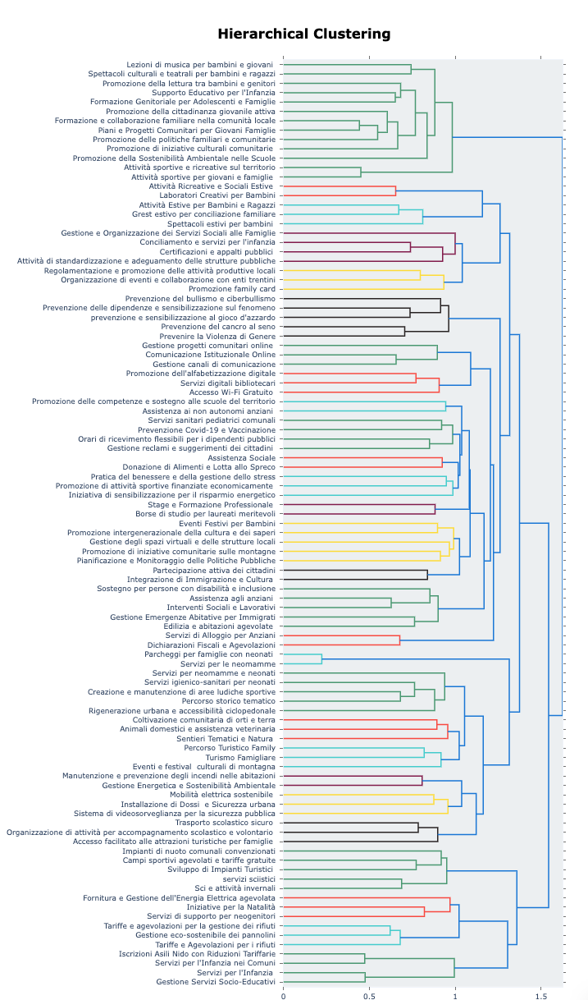

# Creazione di una tassonomia di azioni data-drive 
Repository per la creazione di una tassononmia della azioni in modo data-driven.

## Overview
A partire dal database delle azioni presentate nei piani comunali, è stato implementato un algoritmo di topic modelling basato su transformer (BERTopic – [Grootendorst, 2022](https://arxiv.org/pdf/2203.05794)) per individuare azioni descritte in modo simile e assegnarle a una tassonomia di un certo numero desiderato di categorie. Ogni titolo di ogni azione del database, e la sua descrizione, sono convertiti in un [text embedding](https://it.wikipedia.org/wiki/Word_embedding) da un modello del linguaggio. Per individuare azioni descritte in modo simile che possono fare parte di una stessa categoria, sono poi raggruppati per similarità semantica, iterativamente fino ad arrivare al numero di categorie desiderate. Ogni categoria è descritta tramite le 30 parole più rappresentative. Per ottenere una struttura multi-livello, in modo da suggerire non soltanto le categorie ma anche le macro-categorie, è stato utilizzato hierarchical topic modeling, per cui dopo aver generato le categorie viene creato un ulteriore livello della tassonomia che raggruppa le categorie in macro-categorie che raggruppano ambiti affini. Le 30 parole più rappresentative di ciascuna classe sono poi fornite ad un LLM che propone una etichetta sintetica come categoria dell’azione (passaggio opzionale). 

## Output

  

## Contenuti della repository

1. `model_generation.ipynb` : notebook per generare il modello di topic-modeling 
2. `taxonomy_visualization.ipynb` : notebook che carica il modello genearto in 1. e genera varie visualizzazioni
3. `LLM_label_generation.ipynb` : notebook che genera etichette in linguaggio naturale a partire dalle 30 parole più rappresentative di ogni categoria
4.  cartella `Results` i risultati del modello generato in 1. a partire da circa 17k azioni. (parametri principali: n. classi = 100, testo in input = titolo e descrizione delle azioni). 
  - 4.1 sottocartella `model` in questa cartella è salvato il modello generato in 1. (e utilizzati dallo script `taxonomy_visualization.ipynb`)
  - 4.2 `topics_overview.tsv`
  - 4.3 `topics_overview_renamed.tsv`
  - 4.4 `Dendrogram_taxonomy.html` , `Dendrogram_taxonomy_reanmed.html` Dendrogramma delle categorie, dendrogramma delle categorie rinominate
